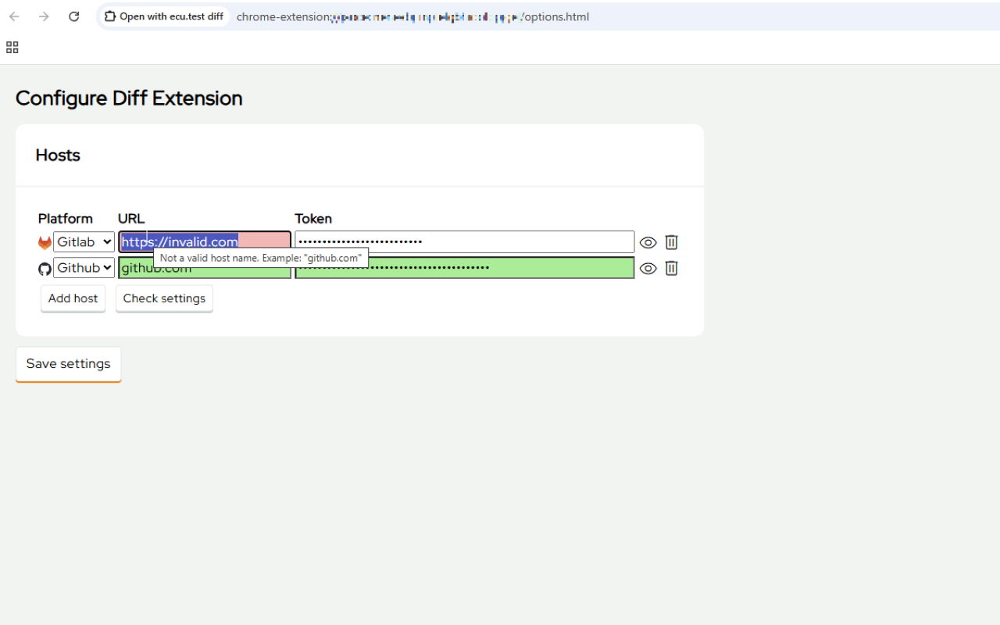

# ecu.test Diff Extension <!-- omit in toc -->

- [Description](#description)
- [Features](#features)
- [Getting started](#getting-started)
  - [Installing and running](#installing-and-running)
  - [Usage](#usage)
  - [Documentation](#documentation)
  - [Contribution](#contribution)
  - [Support](#support)
  - [Licensing](#licensing)

## Description

Browser plugin to open the diff viewer of tracetronic products ecu.test and trace.check from browser.

ecu.test Diff Extension is a bridge between the current browser tab and an installed ecu.test. It allows you to diff packages (`.pkg`) and other artifacts from an open commit or merge request with only a few simple clicks.

## Features

Supported SCM platforms:

- GitHub
- GitLab

Supported entry points

- Single commits
- Merges

Detected file extensions

- `.pkg`
- `.prj`
- `.trf` (view only, no diff)

## Getting started

### Installing and running

TODO: The extention is not yet released on chrome or firefox app stores!

Use the extention in development mode (this mode is probably forbidden via company IT rules!):

**Firefox**

    1. Download the relevant .xpi file from releases.
    2. Go to `about:debugging#/runtime/this-firefox`
    3. Click on load temporary addon select the .xpi file.

**Chrome/Edge**

    1. Click extension icon in the top right corner or Go to "https://chromewebstore.google.com/" and continue with step 4
    2. Click on the "Manage extensions" button
    3. Click on "Chrome Web Store"
    4. Search for "Open with ecu.test diff" and select the found extension
    5. Click on "Add to Chrome"

You are good to go! You can also pin the extension to the toolbar for easy access.

### Usage

- Open a commit or merge request on your SCM platform. Open the extension popup dialog
- Select the correct platform type and add the host
- Go to the options e.g., via click on the cog-wheel icon
- Now enter your API token
  - ⚠️Don't give the token all permissions⚠️
  - Only reading repository and API access
  - fine-grained tokens are recommended



- Save the settings
- Go back to the commit page and open the popup again
- The supported files of the changes will be listed


- Click on a file and click on "Show diff"
- ecu.test Diff-Viewer will be opened
  - ⚠️This needs ecu.test installed and a valid license available⚠️

### Documentation

A detailed documentation on features, build and development setup can be found inside [docs folder](./docs/DeveloperGuide.md).

### Contribution

At the moment, no external contributions are intended and merge requests from forks will automatically be rejected!
To report a bug or request an enhancement to this plugin, please raise a new [GitHub issue](https://github.com/tracetronic/ecu.test-diff/issues).

### Support

If you have any further questions, please contact us at [support@tracetronic.com](mailto:support@tracetronic.com).

### Licensing

This work is licensed under MIT license. This project is based on the boilerplate [Chrome Extension Webpack](https://github.com/sszczep/chrome-extension-webpack) from Sebastian Szczepański. You can find the original license text inside [LICENSE.original](./LICENSE.original).

This project uses the [Red Hat Display Text Font](https://github.com/RedHatOfficial/RedHatFont) with is licensed under SIL OPEN FONT LICENSE Version 1.1 (see [OFL-1.1.txt](./LICENSES/OFL-1.1.txt))

This project uses the [Material Symbols Outlined Font](https://fonts.google.com/icons) with is licensed under Apache License Version 2.0 (see [Apache-2.0.txt](./LICENSES/Apache-2.0.txt))

To generate a software bill of material (sbom) we recommend using the [cyclondx](https://github.com/CycloneDX/cyclonedx-node-npm) tool:

```bash
#skip if you have cyclonedx already installed globally
npm install --global @cyclonedx/cyclonedx-npm

cyclonedx-npm --output-format json --output-file bom.json

#uninstall cyclonedx if desired
npm uninstall --global @cyclonedx/cyclonedx-npm
```

The generated sbom destination is ./bom.json by default. It can be changed using the options
`--output-format` or `--output-file`.
