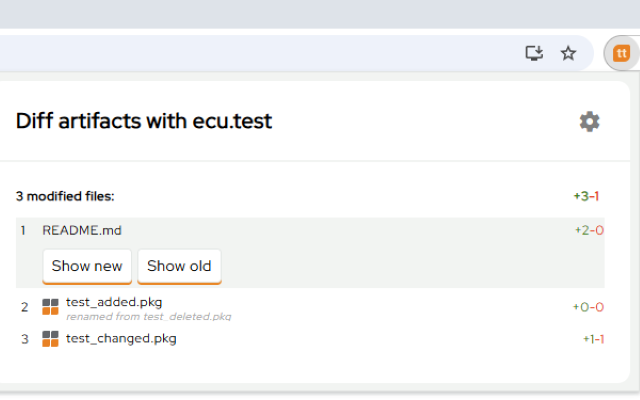
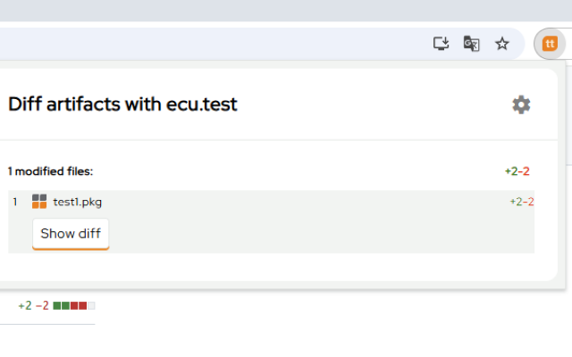

# ecu.test Diff Extension <!-- omit in toc -->


[](https://github.com/tracetronic/ecu.test-diff/actions/workflows/reuse.yml)
[](https://github.com/tracetronic/ecu.test-diff/blob/main/LICENSE)

- [Description](#description)
- [Features](#features)
- [Getting started](#getting-started)
  - [Installation](#installation)
  - [Usage](#usage)
- [Documentation](#documentation)
- [Contribution](#contribution)
- [Support](#support)
- [Licensing](#licensing)

## Description

Browser extension to open the diff viewer of tracetronic products ecu.test and trace.check from browser.

Ecu.test Diff Extension is a bridge between the current browser tab and an installed ecu.test.
It allows you to diff packages (`.pkg`)
and other artifacts from an open commit or merge request with only a few simple clicks.

## Features

Supported SCM platforms:

- GitHub
- GitLab
- Bitbucket Cloud

Supported entry points

- Single commits
- Merges

Detected file extensions

- `.pkg`
- `.prj`
- `.tcf`
- `.tbc`
- `.xam`
- `.ppd`
- `.gcd`
- `.mask`
- `.trf` (view only, no diff)

## Getting started

### Prerequisites

- ecu.test or trace.check **2025.2** or newer installed (2025.1 probably works with some limitations)
- There is no license required for comparing files

### Installation

To install the extension, use the specific installation method for your browser.

**Firefox**

    1. Click extension icon in the top right corner or Go to "https://addons.mozilla.org" and continue with step 3
    2. Click on the "Manage extensions" button
    3. Click on "Find more add-ons" and type "Open with ecu.test diff"
    4. Click on the "Add to Firefox" button
    5. Click on "Add" in the pop-up dialog
    6. Click on "OK" in the pop-up dialog (if needed)

**Chrome/Edge**

    1. Click extension icon in the top right corner or Go to "https://chromewebstore.google.com/" and continue with step 4
    2. Click on the "Manage extensions" button
    3. Click on "Chrome Web Store"
    4. Search for "Open with ecu.test diff" and select the found extension
    5. Click on "Add to Chrome"

You are good to go! You can also pin the extension to the toolbar for easy access.

### Usage

- Open a commit or merge request on your SCM platform. Open the extension popup dialog
- Select the correct platform type and add the host
- You will be redirected to the options page, where the configuration dialog opens up
- Now enter your API token

  - ⚠️Don\'t give the token all permissions, use fine-grained personal access tokens (if possible) ⚠️
  - Only reading repository commits and pull requests and API access
    <details>
      <summary >
        How to create an API token with <b>required minimal access</b>
      </summary>

      - GitHub (see [GitHub Docs](https://docs.github.com/en/authentication/keeping-your-account-and-data-secure/managing-your-personal-access-tokens) )

        Using **fine-grained personal access tokens** is recommended. The have some [**limitations**](https://docs.github.com/en/authentication/keeping-your-account-and-data-secure/managing-your-personal-access-tokens#fine-grained-personal-access-tokens-limitations) (e.g. access a repository where you are only contributor). If you encounter a limitation, try out **Personal access tokens (classic)**.

        1. Go to your profile settings
        2. Go to `Developer Settings`
        3. Select `Personal access tokens` - `Fine-grained tokens`
        4. Select `Generate new token`
        5. Set `Repository access` as desired. If you give access to non-public repositories, make sure to grant `Repository permissions` for `Content` (read-only) and `Pull requests` (read-only)
      - GitLab 
        1. Go to `Settings` - `Access tokens` in the relevant group or repository 
        2. Select `Add new token` 
        3. Set **Scope** to `read_api`, select a **Role** that is allowed to access code and changes
      - Bitbucket Cloud
        - Personal access tokens
          1. Log in to https://id.atlassian.com/manage-profile/security/api-tokens.
          2. Select **Create API token with scopes**.
          3. Select **`read:repository:bitbucket`** and **`read:pullrequest:bitbucket`** scopes.
          >*When using a Bitbucket personal access token, you must also provide the email address that belongs to the token in the extension’s configuration dialog.*
        - Workspace/Project/Repository access tokens
          1. At https://bitbucket.org, navigate to the workspace, project or repository that you want the token to have access to.
          2. Open the corresponding **workspace**, **project** or **repository settings**.
          3. On the sidebar, under **Security**, select **Access tokens**.
          4. Select **Create access tokens**.
          5. Select **`repository`** and **`pullrequest`** permissions.
    </details>
    
    

- Save the settings
- Go back to the commit page and open the popup again
- The supported files of the changes will be listed
- Files that cannot be diffed with the ecu.test Diff-Viewer can still be opened individually for both the old and new versions
- Click on a file and click on "Show new" or "Show old"

  

- Files supported by the ecu.test Diff-Viewer will open directly in the viewer
- Click on a file and click on "Show diff"

  

- ecu.test Diff-Viewer will be opened

    

## Documentation

For detailed documentation on features, build and development setup, see the [DeveloperGuide](./docs/DeveloperGuide.md).

## Contribution

At the moment, no external contributions are intended and merge requests from forks will automatically be rejected!
To report a bug or request an enhancement to this extension,
please raise a new [GitHub issue](https://github.com/tracetronic/ecu.test-diff/issues).

## Support

If you have any further questions, please contact us at [support@tracetronic.com](mailto:support@tracetronic.com).

## Licensing

This work is licensed under MIT license. This project is based on the boilerplate [Chrome Extension Webpack](https://github.com/sszczep/chrome-extension-webpack) from Sebastian Szczepański. You can find the original license text inside [LICENSE.original](./LICENSE.original).

The logos and icons under `static/icons/tracetronic` are Copyright (c) [tracetronic GmbH](https://www.tracetronic.com/) and may be used within this project and may be published to firefox and chrome webstores as part of this project

This project uses the [Red Hat Display Text Font](https://github.com/RedHatOfficial/RedHatFont) with is licensed under SIL OPEN FONT LICENSE Version 1.1 (see [OFL-1.1.txt](./LICENSES/OFL-1.1.txt))

This project uses the [Material Symbols Outlined Font](https://fonts.google.com/icons) with is licensed under Apache License Version 2.0 (see [Apache-2.0.txt](./LICENSES/Apache-2.0.txt))

To generate a software bill of material (sbom), we recommend using the [CycloneDX](https://github.com/CycloneDX/cyclonedx-node-npm) tool:

```bash
#skip if you have cyclonedx already installed globally
npm install --global @cyclonedx/cyclonedx-npm

cyclonedx-npm --output-format json --output-file bom.json

#uninstall cyclonedx if desired
npm uninstall --global @cyclonedx/cyclonedx-npm
```

The generated sbom destination is ./bom.json by default. It can be changed using the options
`--output-format` or `--output-file`.
